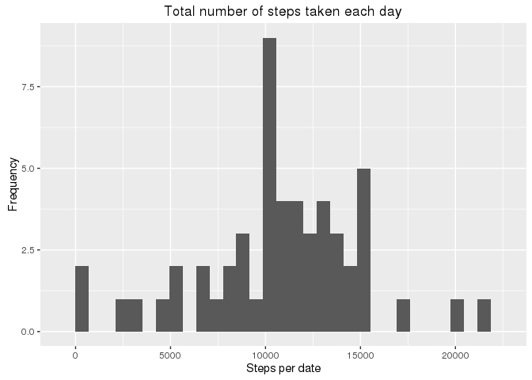
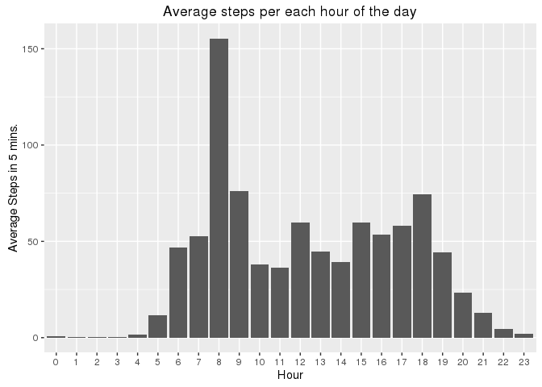
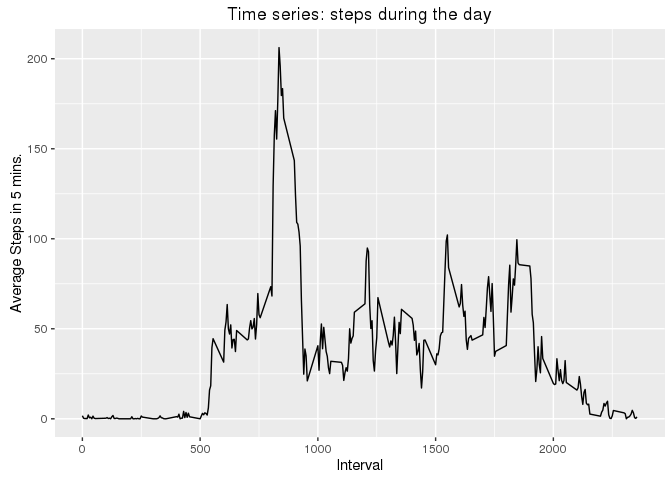
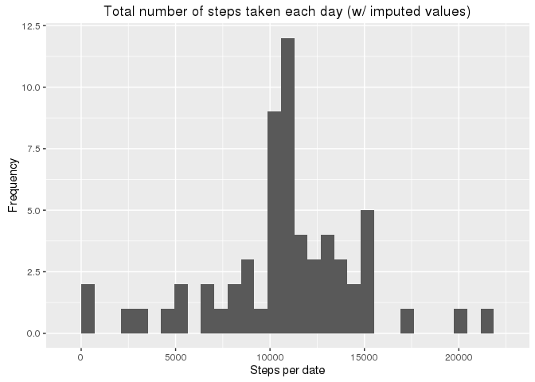
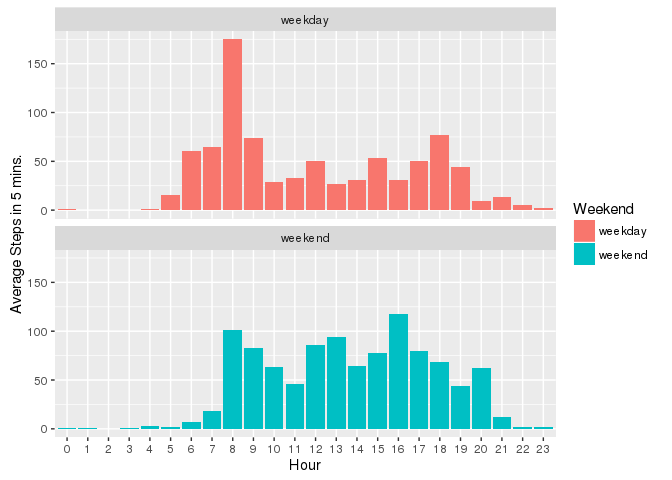
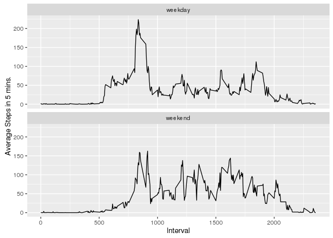
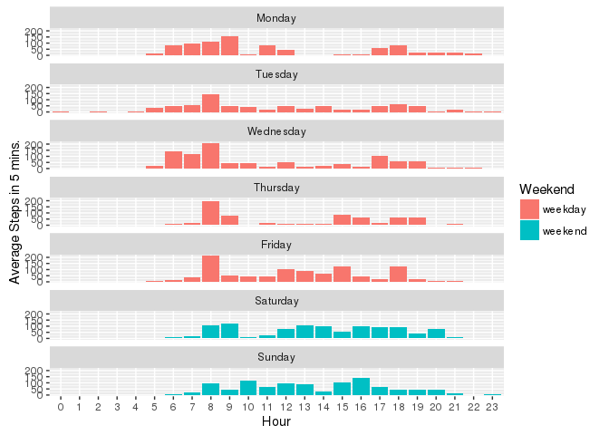

# Reproducible Research: Peer Assessment 1


## Loading and preprocessing the data
### Libraries and environment

```r
library(ggplot2)
```
### Load data


```r
# rm("dfActs")
if (!exists("dfActs")) {
  dfActs <- read.csv("activity.csv")
  # dfActs <- tbl_df(dfActs)
}
nRows <- length(dfActs$steps)
if (exists("dfActs") && nRows == 17568 ) {
  print(sprintf("Read: %s rows. OK", nRows))
}
```

```
## [1] "Read: 17568 rows. OK"
```

```r
df <- dfActs

df$hour <- factor(df$interval %/% 100)

# weekday, weekends
df$wday <- weekdays(as.Date(df$date))

dfWeekend <- data.frame(
  wday=factor(c("Monday", "Tuesday", "Wednesday", "Thursday", "Friday", "Saturday", "Sunday"),
              levels=c("Monday", "Tuesday", "Wednesday", "Thursday", "Friday", "Saturday", "Sunday"),
              ordered=TRUE),
  wend=factor(c("weekday", "weekday", "weekday", "weekday", "weekday", "weekend", "weekend"))
  )
df <- merge(df, dfWeekend, by="wday")
```


## What is mean total number of steps taken per day?

```r
dfStepsByDate <- aggregate(data=df, steps ~ date, sum)
qplot(dfStepsByDate$steps, bins=30,
      main="Total number of steps taken each day",
      xlab="Steps per date",
      ylab="Frequency"
      )
```



```r
nStepsMed <- median(df$steps, na.rm=TRUE)
nStepsAvg <- mean(df$steps, na.rm=TRUE)
```

  * Let me see, ... it must be **37.38** (mean) and **0.00** (median) steps per day.

## What is the average daily activity pattern?

   * The following chart shows the average steps per each hour of the day:

```r
ggplot(na.omit(df), aes(x=hour, y=steps)) +
  stat_summary(fun.y=mean, geom="bar") +
  labs(title = "Average steps per each hour of the day") +
  xlab("Hour") +
  ylab("Average Steps in 5 mins.")
```



   * Observed:
      * The activity is minimal between 23:00 and 4:00
      * The activity starts around 5:00 and grows towards dayly peak around 8:00
      * The activity lowers between 10:00 and 14:00, with a small peak at 12:00.
      * There is a less pronounced growth starting at 15:00 and peaking at 18:00
      * After 18:00 the activity slows decreases until reaching the dayly minimum range (23:00 - 4:00)

### Time series plot of the 5-minute interval (x-axis) and the average number of steps taken, averaged across all days (y-axis)

```r
ggplot(na.omit(df), aes(x=interval, y=steps)) +
  stat_summary(fun.y=mean, geom="line") +
  labs(title = "Time series: steps during the day") +
  xlab("Interval") +
  ylab("Average Steps in 5 mins.")
```



      
###  Which 5-minute interval, on average across all the days in the dataset, contains the maximum number of steps?

```r
dfStepsByInterval <- aggregate(data=df, steps ~ interval, mean)
dfFirsts <- dfStepsByInterval[order(dfStepsByInterval$steps, decreasing=TRUE),][1:5,1:2]
```

   * The first 5 intervals with more steps are:

```r
dfFirsts
```

```
##     interval    steps
## 104      835 206.1698
## 105      840 195.9245
## 107      850 183.3962
## 106      845 179.5660
## 103      830 177.3019
```

   * The interval with most steps is : *835* with *206.17* steps.
   

## Imputing missing values

### 1, Calculate and report the total number of missing values in the dataset (i.e. the total number of rows with NAs)

```r
vNullSteps=which(is.na(df$steps))
nMissing <- length(vNullSteps)
```
   * There are *2304* missings values in the dataset.

### 2. Devise a strategy for filling in all of the missing values in the dataset. 
   * _The strategy does not need to be sophisticated. For example, you could use the mean/median for that day, or the mean for that 5-minute interval, etc._
   
   * There are missing values only on "steps" column
   * The missing values will be imputed using the average for the hour they belong

### 3. Create a new dataset that is equal to the original dataset but with the missing data filled in.

```r
dfStepsAvgByHour <- aggregate(steps ~ hour, data=df, mean, na.rm=TRUE)
names(dfStepsAvgByHour) = c("hour","steps.avg.h")

df2 <- merge(df, dfStepsAvgByHour, by="hour")
# !!! merge() reorders rows !!!
vNullSteps=which(is.na(df2$steps))

df2[vNullSteps,3] <- df2[vNullSteps,7]
```

### 4. Make a histogram of the total number of steps taken each day and ...
   

```r
df2StepsByDate <- aggregate(data=df2, steps ~ date, sum)
qplot(df2StepsByDate$steps, bins=30,
      main="Total number of steps taken each day (w/ imputed values)",
      xlab="Steps per date",
      ylab="Frequency"
      )
```



   * Calculate and report the mean and median total number of steps taken per day. 

```r
nStepsMed2 <- median(df2$steps, na.rm=TRUE)
nStepsAvg2 <- mean(df2$steps, na.rm=TRUE)
```

  * And now : **37.38** (mean) and **0.00** (median) steps per day.
    * Compared to **37.38** (mean) and **0.00** (median) steps per day before imputation..


   * _Do these values differ from the estimates from the first part of the assignment?_
      * There's no difference !
   * _What is the impact of imputing missing data on the estimates of the total daily number of steps?_
      * Well, none actually, while looking at the averages.

## Are there differences in activity patterns between weekdays and weekends?

### Between weekdays and weekend
   * ... let's see
  

```r
dfMean <- aggregate(data=df, steps ~ hour + wend, FUN=mean)

ggplot(df, aes(x=hour, y=steps, fill=wend)) +
  facet_wrap(~wend,nrow=2) +
  stat_summary(fun.y=mean, geom="bar", position=position_dodge(1)) +
  xlab("Hour") +
  ylab("Average Steps in 5 mins.") +
  scale_fill_discrete(name="Weekend")
```

```
## Warning: Removed 2304 rows containing non-finite values (stat_summary).
```



   * Yep, there are.
      * At weekends activity starts slower, and there is a less pronounced peak at 8:00
      * The afternoon peaks at 16:00 on weekends and at 18:00 on weekdays
      * There is more activity in the afternoon upto evening on weekends


   * _Create a new factor variable in the dataset with two levels -- "weekday" and "weekend" indicating whether a given date is a weekday or weekend day._
      * already done, (wend -> Weekend) ...
   * _Make a panel plot containing a time series plot (i.e. type = "l") of the 5-minute interval (x-axis) and the average number of steps taken, averaged across all weekday days or weekend days (y-axis)._

```r
df2Mean <- aggregate(data=df2, steps ~ interval + wend, FUN=mean)


ggplot(data=df2Mean, aes(x=interval, y=steps, fill=wend)) +
  facet_wrap(~wend,nrow=2) +
  geom_line() +
  xlab("Interval") +
  ylab("Average Steps in 5 mins.") +
  scale_fill_discrete(name="Weekend")
```


   


###  And then by each day of the week:

```r
dfMeanDay <- aggregate(data=df, steps ~ hour + wend + wday, FUN=mean)
dfMeanDay$wday <- factor(dfMeanDay$wday,
              levels=c("Monday", "Tuesday", "Wednesday", "Thursday", "Friday", "Saturday", "Sunday"),
              ordered=TRUE) 

ggplot(dfMeanDay, aes(x=hour, y=steps, fill=wend)) +
  facet_wrap(~wday,nrow=7) +
  stat_summary(fun.y=mean, geom="bar", position=position_dodge(1)) +
  xlab("Hour") +
  ylab("Average Steps in 5 mins.") +
  scale_fill_discrete(name="Weekend")
```




